```mermaid
flowchart TB
    subgraph current["RESTRunner.Domain.Tests.csproj"]
        MAIN["<b>📦&nbsp;RESTRunner.Domain.Tests.csproj</b><br/><small>net9.0</small>"]
        click MAIN "#restrunnerdomaintestsrestrunnerdomaintestscsproj"
    end
    subgraph downstream["Dependencies (2"]
        P2["<b>📦&nbsp;RESTRunner.Domain.csproj</b><br/><small>net9.0</small>"]
        P3["<b>📦&nbsp;RESTRunner.PostmanImport.csproj</b><br/><small>net9.0</small>"]
        click P2 "#restrunnerdomainrestrunnerdomaincsproj"
        click P3 "#restrunnerpostmanimportrestrunnerpostmanimportcsproj"
    end
    MAIN --> P2
    MAIN --> P3

```

```mermaid
flowchart TB
    subgraph upstream["Dependants (5)"]
        P1["<b>📦&nbsp;RESTRunner.csproj</b><br/><small>net9.0</small>"]
        P3["<b>📦&nbsp;RESTRunner.PostmanImport.csproj</b><br/><small>net9.0</small>"]
        P4["<b>📦&nbsp;RESTRunner.Services.HttpClientRunner.csproj</b><br/><small>net9.0</small>"]
        P5["<b>📦&nbsp;RESTRunner.Web.csproj</b><br/><small>net9.0</small>"]
        P6["<b>📦&nbsp;RESTRunner.Domain.Tests.csproj</b><br/><small>net9.0</small>"]
        click P1 "#restrunnerrestrunnercsproj"
        click P3 "#restrunnerpostmanimportrestrunnerpostmanimportcsproj"
        click P4 "#restrunnerserviceshttpclientrestrunnerserviceshttpclientrunnercsproj"
        click P5 "#restrunnerwebrestrunnerwebcsproj"
        click P6 "#restrunnerdomaintestsrestrunnerdomaintestscsproj"
    end
    subgraph current["RESTRunner.Domain.csproj"]
        MAIN["<b>📦&nbsp;RESTRunner.Domain.csproj</b><br/><small>net9.0</small>"]
        click MAIN "#restrunnerdomainrestrunnerdomaincsproj"
    end
    P1 --> MAIN
    P3 --> MAIN
    P4 --> MAIN
    P5 --> MAIN
    P6 --> MAIN

```

```mermaid
flowchart TB
    subgraph upstream["Dependants (3)"]
        P1["<b>📦&nbsp;RESTRunner.csproj</b><br/><small>net9.0</small>"]
        P5["<b>📦&nbsp;RESTRunner.Web.csproj</b><br/><small>net9.0</small>"]
        P6["<b>📦&nbsp;RESTRunner.Domain.Tests.csproj</b><br/><small>net9.0</small>"]
        click P1 "#restrunnerrestrunnercsproj"
        click P5 "#restrunnerwebrestrunnerwebcsproj"
        click P6 "#restrunnerdomaintestsrestrunnerdomaintestscsproj"
    end
    subgraph current["RESTRunner.PostmanImport.csproj"]
        MAIN["<b>📦&nbsp;RESTRunner.PostmanImport.csproj</b><br/><small>net9.0</small>"]
        click MAIN "#restrunnerpostmanimportrestrunnerpostmanimportcsproj"
    end
    subgraph downstream["Dependencies (1"]
        P2["<b>📦&nbsp;RESTRunner.Domain.csproj</b><br/><small>net9.0</small>"]
        click P2 "#restrunnerdomainrestrunnerdomaincsproj"
    end
    P1 --> MAIN
    P5 --> MAIN
    P6 --> MAIN
    MAIN --> P2

```

```mermaid
flowchart TB
    subgraph upstream["Dependants (2)"]
        P1["<b>📦&nbsp;RESTRunner.csproj</b><br/><small>net9.0</small>"]
        P5["<b>📦&nbsp;RESTRunner.Web.csproj</b><br/><small>net9.0</small>"]
        click P1 "#restrunnerrestrunnercsproj"
        click P5 "#restrunnerwebrestrunnerwebcsproj"
    end
    subgraph current["RESTRunner.Services.HttpClientRunner.csproj"]
        MAIN["<b>📦&nbsp;RESTRunner.Services.HttpClientRunner.csproj</b><br/><small>net9.0</small>"]
        click MAIN "#restrunnerserviceshttpclientrestrunnerserviceshttpclientrunnercsproj"
    end
    subgraph downstream["Dependencies (1"]
        P2["<b>📦&nbsp;RESTRunner.Domain.csproj</b><br/><small>net9.0</small>"]
        click P2 "#restrunnerdomainrestrunnerdomaincsproj"
    end
    P1 --> MAIN
    P5 --> MAIN
    MAIN --> P2

```

```mermaid
flowchart TB
    subgraph current["RESTRunner.Web.csproj"]
        MAIN["<b>📦&nbsp;RESTRunner.Web.csproj</b><br/><small>net9.0</small>"]
        click MAIN "#restrunnerwebrestrunnerwebcsproj"
    end
    subgraph downstream["Dependencies (3"]
        P2["<b>📦&nbsp;RESTRunner.Domain.csproj</b><br/><small>net9.0</small>"]
        P4["<b>📦&nbsp;RESTRunner.Services.HttpClientRunner.csproj</b><br/><small>net9.0</small>"]
        P3["<b>📦&nbsp;RESTRunner.PostmanImport.csproj</b><br/><small>net9.0</small>"]
        click P2 "#restrunnerdomainrestrunnerdomaincsproj"
        click P4 "#restrunnerserviceshttpclientrestrunnerserviceshttpclientrunnercsproj"
        click P3 "#restrunnerpostmanimportrestrunnerpostmanimportcsproj"
    end
    MAIN --> P2
    MAIN --> P4
    MAIN --> P3

```

```mermaid
flowchart TB
    subgraph current["RESTRunner.csproj"]
        MAIN["<b>📦&nbsp;RESTRunner.csproj</b><br/><small>net9.0</small>"]
        click MAIN "#restrunnerrestrunnercsproj"
    end
    subgraph downstream["Dependencies (3"]
        P2["<b>📦&nbsp;RESTRunner.Domain.csproj</b><br/><small>net9.0</small>"]
        P4["<b>📦&nbsp;RESTRunner.Services.HttpClientRunner.csproj</b><br/><small>net9.0</small>"]
        P3["<b>📦&nbsp;RESTRunner.PostmanImport.csproj</b><br/><small>net9.0</small>"]
        click P2 "#restrunnerdomainrestrunnerdomaincsproj"
        click P4 "#restrunnerserviceshttpclientrestrunnerserviceshttpclientrunnercsproj"
        click P3 "#restrunnerpostmanimportrestrunnerpostmanimportcsproj"
    end
    MAIN --> P2
    MAIN --> P4
    MAIN --> P3

```

# Projects and dependencies analysis

This document provides a comprehensive overview of the projects and their dependencies in the context of upgrading to .NETCoreApp,Version=v10.0.

## Table of Contents

- [Executive Summary](#executive-Summary)
  - [Highlevel Metrics](#highlevel-metrics)
  - [Projects Compatibility](#projects-compatibility)
  - [Package Compatibility](#package-compatibility)
  - [API Compatibility](#api-compatibility)
- [Aggregate NuGet packages details](#aggregate-nuget-packages-details)
- [Top API Migration Challenges](#top-api-migration-challenges)
  - [Technologies and Features](#technologies-and-features)
  - [Most Frequent API Issues](#most-frequent-api-issues)
- [Projects Relationship Graph](#projects-relationship-graph)
- [Project Details](#project-details)

  - [RESTRunner.Domain.Tests\RESTRunner.Domain.Tests.csproj](#restrunnerdomaintestsrestrunnerdomaintestscsproj)
  - [RESTRunner.Domain\RESTRunner.Domain.csproj](#restrunnerdomainrestrunnerdomaincsproj)
  - [RESTRunner.PostmanImport\RESTRunner.PostmanImport.csproj](#restrunnerpostmanimportrestrunnerpostmanimportcsproj)
  - [RESTRunner.Services.HttpClient\RESTRunner.Services.HttpClientRunner.csproj](#restrunnerserviceshttpclientrestrunnerserviceshttpclientrunnercsproj)
  - [RESTRunner.Web\RESTRunner.Web.csproj](#restrunnerwebrestrunnerwebcsproj)
  - [RESTRunner\RESTRunner.csproj](#restrunnerrestrunnercsproj)

## Executive Summary

### Highlevel Metrics

| Metric | Count | Status |
| :--- | :---: | :--- |
| Total Projects | 6 | All require upgrade |
| Total NuGet Packages | 20 | 7 need upgrade |
| Total Code Files | 78 |  |
| Total Code Files with Incidents | 12 |  |
| Total Lines of Code | 11634 |  |
| Total Number of Issues | 153 |  |
| Estimated LOC to modify | 137+ | at least 1.2% of codebase |

### Projects Compatibility

| Project | Target Framework | Difficulty | Package Issues | API Issues | Est. LOC Impact | Description |
| :--- | :---: | :---: | :---: | :---: | :---: | :--- |
| [RESTRunner.Domain.Tests\RESTRunner.Domain.Tests.csproj](#restrunnerdomaintestsrestrunnerdomaintestscsproj) | net9.0 | 🟢 Low | 0 | 0 |  | DotNetCoreApp, Sdk Style = True |
| [RESTRunner.Domain\RESTRunner.Domain.csproj](#restrunnerdomainrestrunnerdomaincsproj) | net9.0 | 🟢 Low | 0 | 2 | 2+ | ClassLibrary, Sdk Style = True |
| [RESTRunner.PostmanImport\RESTRunner.PostmanImport.csproj](#restrunnerpostmanimportrestrunnerpostmanimportcsproj) | net9.0 | 🟢 Low | 0 | 0 |  | ClassLibrary, Sdk Style = True |
| [RESTRunner.Services.HttpClient\RESTRunner.Services.HttpClientRunner.csproj](#restrunnerserviceshttpclientrestrunnerserviceshttpclientrunnercsproj) | net9.0 | 🟢 Low | 2 | 19 | 19+ | ClassLibrary, Sdk Style = True |
| [RESTRunner.Web\RESTRunner.Web.csproj](#restrunnerwebrestrunnerwebcsproj) | net9.0 | 🟢 Low | 4 | 113 | 113+ | AspNetCore, Sdk Style = True |
| [RESTRunner\RESTRunner.csproj](#restrunnerrestrunnercsproj) | net9.0 | 🟢 Low | 4 | 3 | 3+ | DotNetCoreApp, Sdk Style = True |

### Package Compatibility

| Status | Count | Percentage |
| :--- | :---: | :---: |
| ✅ Compatible | 13 | 65.0% |
| ⚠️ Incompatible | 1 | 5.0% |
| 🔄 Upgrade Recommended | 6 | 30.0% |
| ***Total NuGet Packages*** | ***20*** | ***100%*** |

### API Compatibility

| Category | Count | Impact |
| :--- | :---: | :--- |
| 🔴 Binary Incompatible | 0 | High - Require code changes |
| 🟡 Source Incompatible | 0 | Medium - Needs re-compilation and potential conflicting API error fixing |
| 🔵 Behavioral change | 137 | Low - Behavioral changes that may require testing at runtime |
| ✅ Compatible | 11258 |  |
| ***Total APIs Analyzed*** | ***11395*** |  |

## Aggregate NuGet packages details

| Package | Current Version | Suggested Version | Projects | Description |
| :--- | :---: | :---: | :--- | :--- |
| coverlet.collector | 6.0.4 |  | [RESTRunner.Domain.Tests.csproj](#restrunnerdomaintestsrestrunnerdomaintestscsproj) | ✅Compatible |
| CsvHelper | 33.1.0 |  | [RESTRunner.csproj](#restrunnerrestrunnercsproj) | ✅Compatible |
| FileHelpers | 3.5.2 |  | [RESTRunner.Domain.csproj](#restrunnerdomainrestrunnerdomaincsproj) | ✅Compatible |
| Microsoft.AspNet.WebApi.Client | 6.0.0 |  | [RESTRunner.Services.HttpClientRunner.csproj](#restrunnerserviceshttpclientrestrunnerserviceshttpclientrunnercsproj) | ✅Compatible |
| Microsoft.Extensions.Hosting | 9.0.9 | 10.0.1 | [RESTRunner.csproj](#restrunnerrestrunnercsproj) | NuGet package upgrade is recommended |
| Microsoft.Extensions.Http | 9.0.9 | 10.0.1 | [RESTRunner.csproj](#restrunnerrestrunnercsproj) [RESTRunner.Services.HttpClientRunner.csproj](#restrunnerserviceshttpclientrestrunnerserviceshttpclientrunnercsproj) | NuGet package upgrade is recommended |
| Microsoft.Extensions.Logging.Abstractions | 9.0.9 | 10.0.1 | [RESTRunner.Services.HttpClientRunner.csproj](#restrunnerserviceshttpclientrestrunnerserviceshttpclientrunnercsproj) | NuGet package upgrade is recommended |
| Microsoft.NET.Test.Sdk | 17.14.1 |  | [RESTRunner.Domain.Tests.csproj](#restrunnerdomaintestsrestrunnerdomaintestscsproj) | ✅Compatible |
| Microsoft.VisualStudio.Azure.Containers.Tools.Targets | 1.22.1 |  | [RESTRunner.Web.csproj](#restrunnerwebrestrunnerwebcsproj) | ⚠️NuGet package is incompatible |
| MSTest.TestAdapter | 3.10.4 |  | [RESTRunner.Domain.Tests.csproj](#restrunnerdomaintestsrestrunnerdomaintestscsproj) | ✅Compatible |
| MSTest.TestFramework | 3.10.4 |  | [RESTRunner.Domain.Tests.csproj](#restrunnerdomaintestsrestrunnerdomaintestscsproj) | ✅Compatible |
| Newtonsoft.Json | 13.0.4 |  | [RESTRunner.PostmanImport.csproj](#restrunnerpostmanimportrestrunnerpostmanimportcsproj) [RESTRunner.Web.csproj](#restrunnerwebrestrunnerwebcsproj) | ✅Compatible |
| Swashbuckle.AspNetCore | 9.0.4 |  | [RESTRunner.Web.csproj](#restrunnerwebrestrunnerwebcsproj) | ✅Compatible |
| System.Configuration.ConfigurationManager | 9.0.9 | 10.0.1 | [RESTRunner.csproj](#restrunnerrestrunnercsproj) | NuGet package upgrade is recommended |
| System.Net.Http | 4.3.4 |  | [RESTRunner.Web.csproj](#restrunnerwebrestrunnerwebcsproj) | NuGet package functionality is included with framework reference |
| System.Security.Cryptography.Xml | 9.0.9 | 10.0.1 | [RESTRunner.Web.csproj](#restrunnerwebrestrunnerwebcsproj) | NuGet package upgrade is recommended |
| System.Text.Json | 9.0.9 | 10.0.1 | [RESTRunner.csproj](#restrunnerrestrunnercsproj) | NuGet package upgrade is recommended |
| System.Text.RegularExpressions | 4.3.1 |  | [RESTRunner.Web.csproj](#restrunnerwebrestrunnerwebcsproj) | NuGet package functionality is included with framework reference |
| WebSpark.Bootswatch | 1.30.0 |  | [RESTRunner.Web.csproj](#restrunnerwebrestrunnerwebcsproj) | ✅Compatible |
| WebSpark.HttpClientUtility | 1.2.0 |  | [RESTRunner.Web.csproj](#restrunnerwebrestrunnerwebcsproj) | ✅Compatible |

## Top API Migration Challenges

### Technologies and Features

| Technology | Issues | Percentage | Migration Path |
| :--- | :---: | :---: | :--- |

### Most Frequent API Issues

| API | Count | Percentage | Category |
| :--- | :---: | :---: | :--- |
| T:System.Uri | 59 | 43.1% | Behavioral Change |
| T:System.Net.Http.HttpContent | 53 | 38.7% | Behavioral Change |
| M:System.Uri.#ctor(System.String) | 10 | 7.3% | Behavioral Change |
| M:System.Uri.#ctor(System.String,System.UriKind) | 9 | 6.6% | Behavioral Change |
| M:Microsoft.Extensions.DependencyInjection.HttpClientFactoryServiceCollectionExtensions.AddHttpClient(Microsoft.Extensions.DependencyInjection.IServiceCollection) | 2 | 1.5% | Behavioral Change |
| M:Microsoft.Extensions.Logging.ConsoleLoggerExtensions.AddConsole(Microsoft.Extensions.Logging.ILoggingBuilder) | 1 | 0.7% | Behavioral Change |
| T:Microsoft.Extensions.Hosting.HostBuilder | 1 | 0.7% | Behavioral Change |
| M:System.Uri.TryCreate(System.String,System.UriKind,System.Uri@) | 1 | 0.7% | Behavioral Change |
| M:System.Net.Http.HttpContent.ReadAsStreamAsync | 1 | 0.7% | Behavioral Change |

## Projects Relationship Graph

Legend:
📦 SDK-style project
⚙️ Classic project

## Project Details

### RESTRunner.Domain.Tests\RESTRunner.Domain.Tests.csproj

#### Project Info

- **Current Target Framework:** net9.0
- **Proposed Target Framework:** net10.0
- **SDK-style**: True
- **Project Kind:** DotNetCoreApp
- **Dependencies**: 2
- **Dependants**: 0
- **Number of Files**: 12
- **Number of Files with Incidents**: 1
- **Lines of Code**: 476
- **Estimated LOC to modify**: 0+ (at least 0.0% of the project)

#### Dependency Graph

Legend:
📦 SDK-style project
⚙️ Classic project

### API Compatibility

| Category | Count | Impact |
| :--- | :---: | :--- |
| 🔴 Binary Incompatible | 0 | High - Require code changes |
| 🟡 Source Incompatible | 0 | Medium - Needs re-compilation and potential conflicting API error fixing |
| 🔵 Behavioral change | 0 | Low - Behavioral changes that may require testing at runtime |
| ✅ Compatible | 313 |  |
| ***Total APIs Analyzed*** | ***313*** |  |

### RESTRunner.Domain\RESTRunner.Domain.csproj

#### Project Info

- **Current Target Framework:** net9.0
- **Proposed Target Framework:** net10.0
- **SDK-style**: True
- **Project Kind:** ClassLibrary
- **Dependencies**: 0
- **Dependants**: 5
- **Number of Files**: 21
- **Number of Files with Incidents**: 2
- **Lines of Code**: 1428
- **Estimated LOC to modify**: 2+ (at least 0.1% of the project)

#### Dependency Graph

Legend:
📦 SDK-style project
⚙️ Classic project

### API Compatibility

| Category | Count | Impact |
| :--- | :---: | :--- |
| 🔴 Binary Incompatible | 0 | High - Require code changes |
| 🟡 Source Incompatible | 0 | Medium - Needs re-compilation and potential conflicting API error fixing |
| 🔵 Behavioral change | 2 | Low - Behavioral changes that may require testing at runtime |
| ✅ Compatible | 1066 |  |
| ***Total APIs Analyzed*** | ***1068*** |  |

### RESTRunner.PostmanImport\RESTRunner.PostmanImport.csproj

#### Project Info

- **Current Target Framework:** net9.0
- **Proposed Target Framework:** net10.0
- **SDK-style**: True
- **Project Kind:** ClassLibrary
- **Dependencies**: 1
- **Dependants**: 3
- **Number of Files**: 3
- **Number of Files with Incidents**: 1
- **Lines of Code**: 303
- **Estimated LOC to modify**: 0+ (at least 0.0% of the project)

#### Dependency Graph

Legend:
📦 SDK-style project
⚙️ Classic project

### API Compatibility

| Category | Count | Impact |
| :--- | :---: | :--- |
| 🔴 Binary Incompatible | 0 | High - Require code changes |
| 🟡 Source Incompatible | 0 | Medium - Needs re-compilation and potential conflicting API error fixing |
| 🔵 Behavioral change | 0 | Low - Behavioral changes that may require testing at runtime |
| ✅ Compatible | 662 |  |
| ***Total APIs Analyzed*** | ***662*** |  |

### RESTRunner.Services.HttpClient\RESTRunner.Services.HttpClientRunner.csproj

#### Project Info

- **Current Target Framework:** net9.0
- **Proposed Target Framework:** net10.0
- **SDK-style**: True
- **Project Kind:** ClassLibrary
- **Dependencies**: 1
- **Dependants**: 2
- **Number of Files**: 2
- **Number of Files with Incidents**: 2
- **Lines of Code**: 373
- **Estimated LOC to modify**: 19+ (at least 5.1% of the project)

#### Dependency Graph

Legend:
📦 SDK-style project
⚙️ Classic project

### API Compatibility

| Category | Count | Impact |
| :--- | :---: | :--- |
| 🔴 Binary Incompatible | 0 | High - Require code changes |
| 🟡 Source Incompatible | 0 | Medium - Needs re-compilation and potential conflicting API error fixing |
| 🔵 Behavioral change | 19 | Low - Behavioral changes that may require testing at runtime |
| ✅ Compatible | 447 |  |
| ***Total APIs Analyzed*** | ***466*** |  |

### RESTRunner.Web\RESTRunner.Web.csproj

#### Project Info

- **Current Target Framework:** net9.0
- **Proposed Target Framework:** net10.0
- **SDK-style**: True
- **Project Kind:** AspNetCore
- **Dependencies**: 3
- **Dependants**: 0
- **Number of Files**: 47
- **Number of Files with Incidents**: 4
- **Lines of Code**: 8744
- **Estimated LOC to modify**: 113+ (at least 1.3% of the project)

#### Dependency Graph

Legend:
📦 SDK-style project
⚙️ Classic project

### API Compatibility

| Category | Count | Impact |
| :--- | :---: | :--- |
| 🔴 Binary Incompatible | 0 | High - Require code changes |
| 🟡 Source Incompatible | 0 | Medium - Needs re-compilation and potential conflicting API error fixing |
| 🔵 Behavioral change | 113 | Low - Behavioral changes that may require testing at runtime |
| ✅ Compatible | 8306 |  |
| ***Total APIs Analyzed*** | ***8419*** |  |

### RESTRunner\RESTRunner.csproj

#### Project Info

- **Current Target Framework:** net9.0
- **Proposed Target Framework:** net10.0
- **SDK-style**: True
- **Project Kind:** DotNetCoreApp
- **Dependencies**: 3
- **Dependants**: 0
- **Number of Files**: 5
- **Number of Files with Incidents**: 2
- **Lines of Code**: 310
- **Estimated LOC to modify**: 3+ (at least 1.0% of the project)

#### Dependency Graph

Legend:
📦 SDK-style project
⚙️ Classic project

### API Compatibility

| Category | Count | Impact |
| :--- | :---: | :--- |
| 🔴 Binary Incompatible | 0 | High - Require code changes |
| 🟡 Source Incompatible | 0 | Medium - Needs re-compilation and potential conflicting API error fixing |
| 🔵 Behavioral change | 3 | Low - Behavioral changes that may require testing at runtime |
| ✅ Compatible | 464 |  |
| ***Total APIs Analyzed*** | ***467*** |  |

